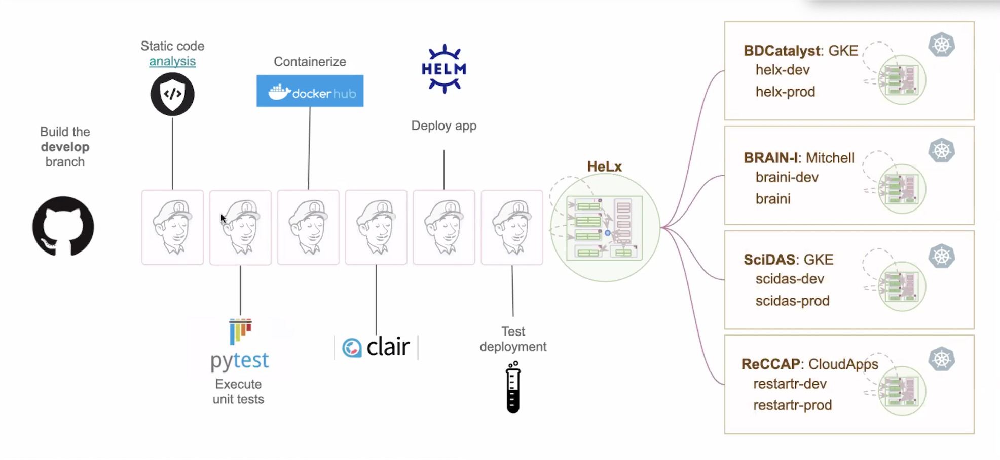

# Continuous Integration/Continuous Delivery




##
Continuous Integration/Continuous Delivery (CI/CD) is a set of best practices implemented through automation that raise code quality, increase developer productivity, detect defects and security issues as early as possible, and help deliver high quality software to customers. Because it removes significant overhead from developers, it speeds development and lowers development costs.

CI/CD is implemented as an automation pipeline. The HeLX CI/CD pipeline consists of build, static analysis, unit test, containerization, security scanning, and deployment stages.

## Build

### Jenkins
1) **General Approach**\
The HeLX CI/CD is based on a pipeline of services that process, test, package, and deploy the code. To the extent possible, these services are run on and by a Jenkins server run on a cluster hosted at RENCI. This Jenkins server is run as a Docker container managed by Kubernetes on the cluster.

   The one exception to this is static analysis, which is run on GitHub, due to the choice to use the Super-Linter lint aggregator. It runs as a Github workflow action on GitHub servers.

   Using a containerized Jenkins server allows the entire CI/CD pipeline to be backed up and restored in the case of a crash or outage along with its build data, along with all the other normal benefits of containerized services.

2) **System Architecture**\
    a) **Machine User**\
    A machine user represents developers on Github and Dockerhub to prevent the need for any individual userids and passwords in build scripts. This user also allows multiple developers to monitor incoming correspondence from Github and Dockerhub and respond as needed.
  
    b) **Docker**
    1) **DockerFile**\
       The Jenkins server is based on the Jenkins:lts Docker image (currently jenkins-2.4.0), with modifications required for HeLX. This includes modifications for running Docker in a Docker container, docker-ce, docker-ce-cli, docker-compose, building certain languages, clair security scanner, and tools to ease administration (curl, less, vim-tiny, sudo).
    
       Most changes are added as the **root** user. Although its not visible in our Dockerfile, the jenkins:lts image does add a **jenkins** user Our Dockerfile switches to the **jenkins** user before adding some file changes which need **jenkins** user file permissions. This also becomes the running user on the container. One additional user, **jovyan**, is added, which is required for the blackbalsam build.
    
       The [Dockerfile](https://github.com/helxplatform/devops/cicd/jenkins/jenkins-master/docker/Dockerfile) is located in the GitHub 
**helxplatform/devops** repo.

    2) **Docker In Docker**\
       Because Jenkins is running as a Docker container and has to build new Docker containers, a problem arises: how to run Docker in Docker. Because Docker wasn't designed to run this way, it presents a unique set of challenges. 
       The seminal article about this, ["Using Docker-in-Docker for your CI or testing environment? Think twice."](https://jpetazzo.github.io/2015/09/03/do-not-use-docker-in-docker-for-ci/) was written by Jérôme Petazzoni. Petazzoni outlines three major problems with running Docker in Docker:
         - It conflicts with and confuses Linux Security Modules) like AppArmor and SELinux.
         - It creates conflicts between storage drivers, since the outer Docker  container runs on a "normal" filesystem such as EXT4 but the inner Docker will run on a copy-on-write filesystem such as AUFS or perhaps Device Mapper. Many combinations of filesystems won't even work together and they depend on what the outer Docker container is using. Even the official DIND repo runs into these issues.
         - Most critically, it creates problems with build caches which can lead to data corruption.
       He does however, offer a solution: enabling a docker socket in the CI container using the -v switch to bind-mount /var/run/docker.sock to it. This gives the container access to the Docker socket so that is can build, push, and start containers. The only difference from a "true" Docker in Docker solution is that when it starts a container, instead of starting a “child” container, it starts a “sibling” container. Since the goal of CI is building and pushing images, this is not an issue.
       
       The HeLX implementation does use this approach since its the least problematic. The code that does this is in the Deployment section of the Kubernetes resource file, [jenkins-blackbalsam-k8s-no-jcasc.yaml](https://github.com/helxplatform/devops/cicd/jenkins/jenkins-master/kubernetes/jenkins-blackbalsam-k8s-no-jcasc.yaml) (see below under Kubernetes for more information on this file).
     
    c) **Kubernetes**\
    The Jenkins server's docker capabilities are managed using Kubernetes. All Kubernetes resource files are combined into one yaml file, [jenkins-blackbalsam-k8s-no-jcasc.yaml](https://github.com/helxplatform/devops/cicd/jenkins/jenkins-master/kubernetes/jenkins-blackbalsam-k8s-no-jcasc.yaml) which is stored in Github's **helxplatform/devops** repo. The following types of Kubernetes resource files are combined into this one file. For more specifics on the information defined within the individual sections, please view the [file](https://github.com/helxplatform/devops/cicd/jenkins/jenkins-master/kubernetes/jenkins-blackbalsam-k8s-no-jcasc.yaml) itself.
      - Service Account
        - Provides an identity for the Pod.
      - Secret
         - Defines Admin username and password.
      - Jenkins ConfigMap
         - Contains:
           - config.xml
           - Location configuration (URL)
           - CLI toggle (set to true)
           - apply_config.sh
             - Applies the Jenkins XML configuration.
             - Installs plugins.
           - plugins.txt
             - The list of plugins to be installed including their versions.
      - Jenkins Tests ConfigMap
        - Contains:
          - run.sh
            - A test which checks if Jenkins is up and available for login after startup.
      - Role
        - Defines a Jenkins uses to schedule agents via the Kubernetes plugin.
      - RoleBinding
        - Binds the scheduling role (above) to the Jenkins Service Accounts.
      - Jenkins Service
        - Defines characteristics such as ports and service type of main Jenkins service.
      - Jenkins-Agent Service
        - Defines characteristics such as ports and service type of Jenkins agents.
      - Jenkins Deployment
        - Defines init containers and containers of Jenkins including environment, resources, volumes, liveness probes, and the /var/docker.sock Docker connection.
    
3) **Build Scripts**\
   Each project is configured with what Jenkins refers to as a "freestyle" build script. Freestyle build scripts are Bash scripts that are input into the Jenkins "Configure" UI.

   Each script follows a similar pattern:
     - Defines pathnames and other necessary definitions.
     - Retrieves the bashlib library from GitHub, which contains versioning functions if automatic versioning is used (see below).
     - Retrieves the clair library functions for security scanning from GitHub (see below).
     - Pulls the code from GitHub to the workspace.
     - Gets the version number (and increments it for automatic versioning--see below).
     - Calls **docker build** to build the image.
     - If the build fails, it exits. If it succeeds, continues to the next step.
     - Sets up and executes unit tests, typically using pytest.
     - If unit tests fail, it exits and emails the result. If it succeeds, continues to the next step.
     - Calls **docker push** to push the images to DockerHub.
     - Calls the scan_clair library function to do security scanning (see below). Note that the images must be in a Docker repository in order for clair to scan them.
     - Calls the postprocess_clair_output library function to clean the clair data, turn it from json into an html table, and set it up in a web server.
     - Removes the built images, now that they're in Docker, to save space.

   **Notes:**
      - In addition to the freestyle approach, scripts can be done in a pipeline format. There are some advantages to doing the pipeline format and it may be worth doing future scripts using this approach.
      - It's likely that the pattern described above can be condensed into one or more library functions, added to bashlib, and then just called from the build script.
      - Images must be in a Docker repository in order for clair to scan them.
  
   
4) **Versioning**\
There are two types of versioning currently used in HeLX CICD, manual and automatic. Most projects use automatic versioning with a small number (2-3) still using the older manual approach. They will be converted eventually so that there's only one versioning approach.
  
    a) **Manual**\
    Manual versioning works with the use of a hidden .ver file which contains the version number. This file typically lives in the top level bin directory or in some cases in docker/bin where the comp shell scripts exists. Developers increment the version in this file when they wish to bump the version up. TranQL is an example of a project currently using this type of versioning. Code typically retrieves the version in a build script this way:
    ```````````````````````````````
    ver=$(cat ./docker/bin/.ver)
    ```````````````````````````````
    This can help identify manually versioned build scripts.  
    
    b) **Automatic**\
    Automatic versioning uses two bash functions and a version files on the jenkins server to manage version numbers. These functions, get_ver and incr_ver, live in bash_lib on GitHub in the devops repo. The version files are initially set by the build script under the jobs directory for the project's build. For example, for the develop build for appstore, the version file will be set at:
    `````````````````````````````````````````````````
    $JENKINS_HOME/jobs/appstore/version/develop/ver
    `````````````````````````````````````````````````
    The format of the version file is:
    `````````````````````````````````````````````````
    vN.N.NN
    `````````````````````````````````````````````````
    where 'v' is simply the letter 'v', each N stands for a single integer 0-9, and '.' is the decimal point.\
    incr_ver is set up to increment the two digit portion from 1-99 and the single digit portions from 0-9. If a need arises to increment an image differently, for example, to go from v0.0.48 to v1.0.0, the file can be edited manually, and the automation will continue incrementing at v1.0.1.

## Static Analysis/Lint

### Introduction
GitHub has a new static analysis tool called [Super-Linter](https://github.com/github/super-linter), which HeLX CI/CD uses in as the first step in its pipeline. This tool aggregates linters for 36 different programming languages. Some languages, in turn, have as many as four different linters each. Python, for example, has three, **pylint**, **flake8**, and **black**.

### Set up:
Super-Linter runs as a GitHub [Action](https://github.com/features/actions). Actions are workflows that run on GitHub. As such, they must be set up directly on GitHub and don't run directly on the Jenkins server like the rest of the CI/CD pipeline. 

Here are the steps to set up a new repo for the Super-Linter action:
1) Ensure that the machine user has admin permissions for the repo.
2) Log into GitHub as the machine user.
3) Go to "Actions"
4) Look through the list of workflow templates and click on "Simple workflow" --> "Set up this workflow"
5) At the top of the template, give it the name **linter.yml**
6) Highlight the entire text of the workflow file and paste in the yaml text below in its place.
7) Save the file.
8) This sets up an action on the **default** branch (usually the master branch), which must be done before setting up an action on any non-default branch. To set up an action on a non-default branch after saving this file, **merge** this file to the desired branch. **Copying it in will not work.**
```````````````````````````````````````````````````````````````````````````````````````````````````````````````
name: Linter

on:
  push:
    branches: [ master, develop ]

jobs:
  build:
    runs-on: ubuntu-latest

    steps:
    - uses: actions/checkout@v2

    - uses: fregante/setup-git-token@v1
      with:
        token: ${{ secrets.GITHUB_TOKEN }}

    - name: Super-Linter
      uses: github/super-linter@v3
      env:
        VALIDATE_ALL_CODEBASE: false
```````````````````````````````````````````````````````````````````````````````````````````````````````````````

**Notes:**
  - The action is triggered on commits to GitHub (see "on: push:" in the yaml).
  - The yaml file passes a GitHub token to the workflow. However, there's a GitHub bug which causes it to to not recognize the token, so the logs will complain about not getting one. The action works anyway.
  - Super-Linter was designed to be used with a pull request model rather than using a push event. That would allow the developer to fix any linting errors under the pull request before it is closed and is thus cleaner as the commmit will ultimately show a check next to it since you can make multiple commits under a pull request. With a push model, if there are errors, an "x" will show for that commit and it must be fixed with a second commit, which will then have a check next to it.
  - Super-Linter defaults to linting the entire repo at once. This leads to an enormous amount of output when run on a large existing body of code. For this reason, we decided to set **VALIDATE_ALL_CODEBASE** to **FALSE**. This means that only new and changed files in a commit are linted, which is more manageable during a development cycle. In a greefield condition, setting it to **TRUE** makes more sense.
  - Other individual linter settings have been left at their defaults. With the number of linters involved, each having dozens of settings, it seemed prudent to let them run with their well-considered defaults initially and then adjust for any pain points as needed.
  - GitHub hints that it has plans to move Super-Linter "closer to the developer" in the future. But for now, using it locally is unsupported. That said, it is possible to get it to run locally using the instructions found [here](https://github.com/github/super-linter/blob/master/docs/run-linter-locally.md). However, it was not possible to get it running directly in a container on the server in the time available and may not be possible until GitHub develops it further.

## Unit Test
Unit tests are conducted after the build if the build passes. The tests are set up and executed as part of the freestyle bash script part of the build in all but one case. The TranQL build, however is split into two separate builds.  The first, called tranQL-server, runs the unit tests. If it succeeds, it invokes tranql-docker, which then proceeds to to the actual build.

The remaining builds proceed by creating a python virtual environment and sourcing it, then using python's pip to install the necessary requirements to run the application from the project's requirements.txt file. They then invoke pytest directly or, more frequently, a bash script in the project's bin directory to run the tests.

## Containerize
If the build passes its unit test phase, the images that were created using the **docker build** command and pushed to DockerHub using the **docker push** command and where they are stored in DockerHub public repositories.

## Security Scan
Security scanning is done by using the open source vulnerability container scanner **clair**.  The base **clair** program, originally created by CoreOS, is [available](https://github.com/quay/clair) in GitHub. However, HeLX CICD uses two versions with additional capabilities from the **arminc** repo. [clair-scanner](https://github.com/arminc/clair-scanner) is an enhanced scanner that includes the use of a whitelist. And [clair-local-scan](https://github.com/arminc/clair-local-scan) provides a server and postgres database pre-loaded with vulnerability information that is updated daily. This is important because vulnerability information is updated each day and uploading this information to the database generally takes thirty minutes or more. With **clair-local-scan**'s pre-built containers, new server/database containers can simply be started each day with essentially no downtime due to loading.

A library function has been created called scan_clair, which users can call from their builds using environmental variables describing the build image and version they wish to scan. A typical call looks as follows:
```````````````````````````
scan_clair "$ORG" "$REPO" "$BUILD_BRANCH" "$ver" || true
```````````````````````````
The use of "|| true" at the end is required because clair returns a non-zero return code when it finds vulnerabilities, which will stop the build without it.

The scan_clair function does some preliminary work to determine required IP addresses for the scan, pulls the image if necessary, and invokes the scanner.

A second function, **post_process_clair_output** is also available, which 

- Cleans control characters from the data,
- Converts JSON output into an HTML table,
- Removes redundant data,
- Removes CVE's below a given threshold,
- Turns all URL's into HTML links, and
- Adds some CSS to remove double lines between table cells and provide other formatting.

This function is called in the following manner:
```````````````````````````
post_process_clair_output "$ORG" "$REPO" "$BUILD_BRANCH" "$ver"
```````````````````````````
It is not currently invoked pending the creation of a dashboard. Calls to **post_process_clair_output** will be added to builds once the dashboard is in place.
